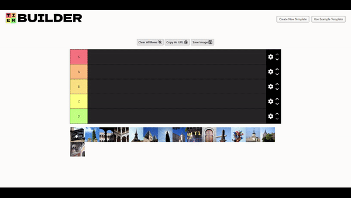

<div align="center">
  
  
  # Tierbuilder
  Tiermaker clone built in React
  
  
  
  
  
  
  

  

  [Try it out here](https://jthefox.github.io/tierbuilder/)
</div>

## Table of Contents

1. [Description](#description)
2. [Motivation](#motivation)
3. [Installation](#installation)
4. [Testing](#testing)

## Description

Tierbuilder is a slimmed down clone of [Tiermaker.com](https://tiermaker.com/) built in React.
This application utilizes [RBD](https://github.com/atlassian/react-beautiful-dnd) for the core drag & drop functionality, and [Redux](https://redux.js.org/) plus [React Router](https://reactrouter.com/en/main) for persistent state and routing in lieu of a backend. Despite there being no backend, users can still share their creations through a shareable url through conversion of state to/from base64. The tradeoff here is a lengthy url for no server-side dependency, but still suitable for a custom API to be added at any time. Users can also upload their own images for tierbuilding, customize each row of items, and save their finished product as an image through custom canvas-based rendering.

## Motivation

You can find a million guides on how to make a Netflix, Twitter, or some other generic clone. I wanted to do something different that I _couldn't_ find a step-by-step guide for. I ended up setting my sights on Tiermaker after looking at [this Tiermaker clone](https://github.com/BladeBoles/tiermaker-clone) that had become defunct from outdated dependencies, using React, TypeScript, and Vitest. I also decluttered and added small improvements to the existing Tiermaker UI in this version.

## Installation

1. Clone the project

```sh
git clone https://github.com/jthefox/tierbuilder.git
```

2. Install dependencies

```sh
npm install
```

3. Start the development server

```sh
vite
```

## Testing

- For testing, run

```sh
npm run test
```

or

```sh
vitest
```

- For code coverage, run

```sh
npm run coverage
```
